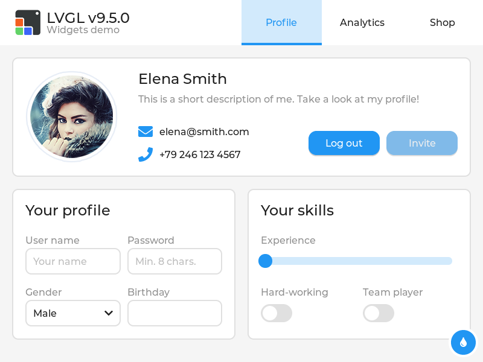
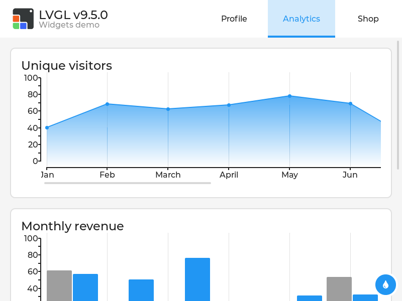
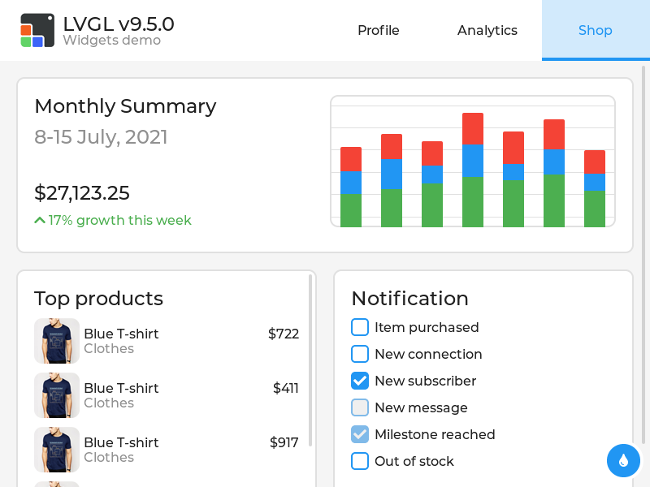
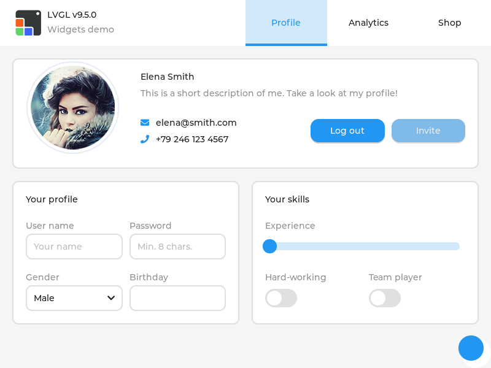
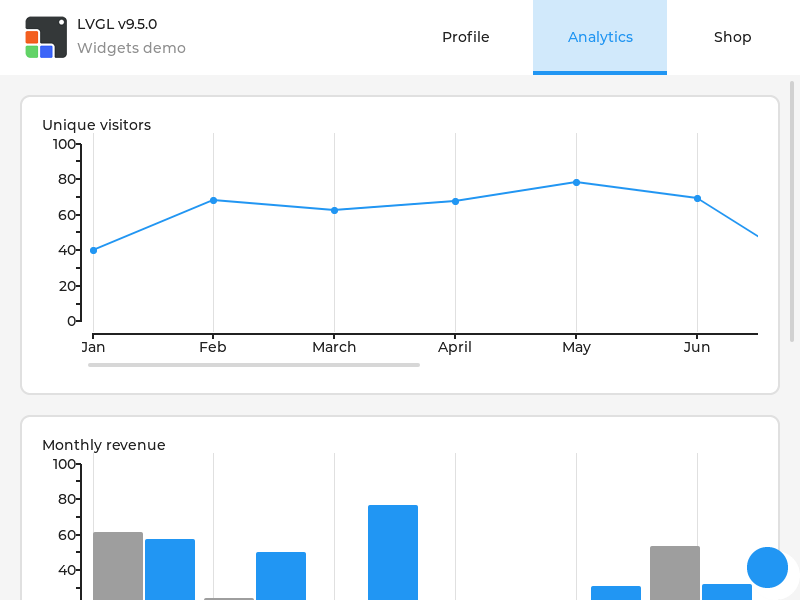
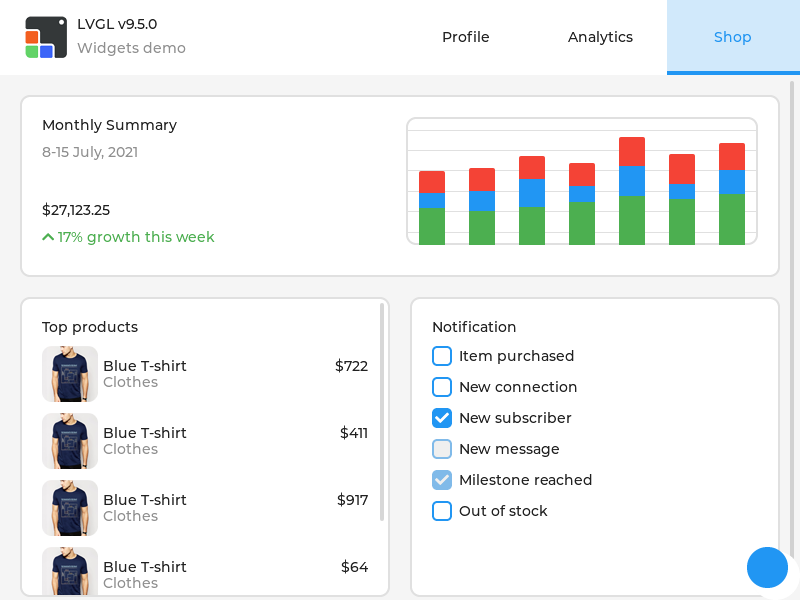

# lvgl_app2pro

Turn an **existing LVGL application** into an **LVGL Pro XML project**.

The converter needs an LVGL application that runs on your PC. No source code is
needed. It starts the app using GDB, stops it once the UI is up, and reads the
real widget tree out of the process with
[LVGL's GDB plugin](https://docs.lvgl.io/master/debugging/gdb_plugin.html). Once
the screens, widgets, properties, images, styles, etc. are known, the converter
writes the equivalent XML as a ready to use LVGL Pro project.

Below is each tab of `lv_demo_widgets` as the C application draws it, next to the
converted XML project. Nothing was edited by hand in between. 

| | Profile | Analytics | Shop |
| --- | --- | --- | --- |
| Original (C) |  |  |  |
| Converted (XML) |  |  |  |

All the layouts, properties, and images were extracted and converted correctly, but 
the fonts and custom functions/callbacks needs to be added by the user.


## Why migrate to LVGL Pro XML?

LVGL Pro is the official toolkit of LVGL, providing a lot of features to develop
commercial products much simpler and faster:

- Declarative [XML language](https://lvgl.io/docs/pro/syntax/introduction) that
  easily handles [Components](https://lvgl.io/docs/pro/syntax/components),
  [Data bindings](https://lvgl.io/docs/pro/syntax/data-binding),
  [Translations](https://lvgl.io/docs/pro/syntax/translations),
  [Animations](https://lvgl.io/docs/pro/syntax/animations), etc.
- [Real time preview](https://lvgl.io/docs/pro/syntax/preview) to see how the
  components and screens look while you edit
- [Inspector tool](https://lvgl.io/docs/pro/editor/overview) to immediately
  understand layouts and sizes
- [CLI tool](https://lvgl.io/docs/pro/cli) to run
  [UI tests](https://lvgl.io/docs/pro/syntax/testing) in CI/CD and allow
  [AI agents](https://lvgl.io/docs/pro/ai) to write XML and validate with
  screenshots
- [Online share](https://lvgl.io/docs/pro/online-viewer) to show the project in
  a browser
- [Figma plugin](https://lvgl.io/docs/pro/figma) to import projects with one
  click

These led to a workflow where developers can work much faster and with more
confidence, and can collaborate with designers and stakeholders with ease. Learn
more about LVGL Pro at https://lvgl.io/pro

Of course, migrating applications by hand is also possible, however it's quite
slow and prone to mistakes.


## Requirements

- **GDB**: usually embeds Python too. Check that it has at least Python 3.10
  with `gdb -batch -ex "python import sys; print(sys.version)"`
- **Python 3.10** or newer to run the converter itself (this is a separate
  interpreter from the one inside GDB, and the versions need not match)
- An LVGL application that runs on your PC, built with debug symbols (`-O0 -g3`)
- **CMake** and **SDL2**, only to build the example in this repository

If you can already compile LVGL applications, these are probably installed. If
not, install them now:

Linux (Debian and Ubuntu; SDL2 and CMake are for the bundled example only):

```bash
sudo apt install gdb python3 build-essential cmake libsdl2-dev
```

Windows: use [MSYS2](https://www.msys2.org) and install the same tools in its
MinGW64 shell:

```bash
pacman -S mingw-w64-x86_64-gdb mingw-w64-x86_64-python mingw-w64-x86_64-gcc \
          mingw-w64-x86_64-cmake mingw-w64-x86_64-SDL2
```

macOS: GDB is not usable out of the box, because it has to be code-signed to
control another process, and it does not support Apple Silicon. Convert on Linux
or Windows, or in a container, for now.

## Quick start

To convert your application to XML, all you need is an LVGL application that can
run on your PC.

First, you will need this repository to run the converter:

```bash
git clone https://github.com/lvgl/lvgl_pro
cd lvgl_pro/tools/lvgl_app2pro
```

Next, you will need a compiled LVGL application. Make sure it's compiled with no
optimization (`-O0`) and debug symbols (`-g3`). If you wish, you can compile and
use the example from this repository, which creates a UI from `lv_demo_widgets`.
(Note that it requires SDL.)

```bash
cmake -B examples/lv_demo_widgets/build -S examples/lv_demo_widgets
cmake --build examples/lv_demo_widgets/build -j
```

If you have the application, you can start converting it to XML like this:

```bash
python3 lvgl_app2pro.py examples/lv_demo_widgets/build/lv_demo_widgets -o widgets_demo
```

(Replace the path of the example with the path of your app if needed.)

The output in the terminal should be something like this:

```
GDB Python: 3.12
Running examples/lv_demo_widgets/build/lv_demo_widgets to lv_timer_handler ...

Wrote 3 files to widgets_demo
  1 screens, 129 widgets
  20 styles (0 shared)
  3 color consts, 16 number consts
  4 images rebuilt as PNG
  2 fonts to declare: lv_font_montserrat_16, lv_font_montserrat_24

  10 event callbacks to implement (10 attachments):
    slider_event_cb(lv_event_t * e)   on all
    ...
```

The result is a project that you can open in the Editor:

```
widgets_demo/
  project.xml        display size and LVGL version
  globals.xml        consts, shared styles, image declarations
  screens/*.xml      one file per screen
  images/*.png       images recovered from the binary
```

A snippet from the resulting XML:

```xml
<lv_tabview active="0" tab_bar_position="top" style_layout="flex" style_flex_flow="column">
    <lv_tabview-tab_bar height="75" width="100%" style_pad_left="400">
        <lv_image align="left_mid" x="-375" src="img_lvgl_logo" />
    </lv_tabview-tab_bar>
    <lv_tabview-tab text="Profile" style_layout="grid"
                    style_grid_column_dsc_array="content 5 content 2fr 1fr 1fr">
        <lv_label text="Elena Smith" />
        ...
```

## Features and Limitations

**What converts:**

- ✅ Every screen from one stop.
- ✅ The widget tree, with each widget's properties, states and flags.
- ✅ Elements of complex widgets, like chart series, tabview tabs, scale sections, etc.
- ✅ Flex and Grid layouts,.
- ✅ `LV_PCT()` and `LV_SIZE_CONTENT`, as `50%` and `content`
- ✅ Styles, local ones as inline attributes and shared ones as named styles
  in `globals.xml`. Theme styles are ignored.
- ✅ Images stored as C array are recreated as PNG
- ✅ Colors and repeated numbers are converted into consts.
- ✅ Event hooks, as `<event_cb>` with the callback name and trigger.

**Limitation:**


- ❌ Only LVGL v9.5 is supported
- ❌ No custom components are added. The screens contain all their widgets in one screen XML file,
- ❌ Event callback's code, needs to be added manually. See `TODO` comments in XML.
- ❌ Animations are ignored. IF there were an animation the start value is read and used on teh widget
- ❌ Fonts can't be restored from the app. The names are used where possible, but the fonts needs to be added in `globals.xml` manually.
- ❌ Subjects and bindings
- ❌ Translations
- ❌ Timers
- ❌ Compressed and indexed images are reported but not resptored
- ❌ Screens that do not exist yet, but created manually. Only the screen avaialbe initially are converted
- ❌ Constant/define names are not kept, automatically generated names are used instead.

**Improvment options**

Either manually or by an AI agent:

1. See the report from the terminal to see what caould be converted
2. Open the project in LVGL Pro Editor
3. Manully add the fonts in `globals.xml`
4. Add the events in `<project_name>.c`
5. Manaully add the animations, timers, and data bindings
6. Create XML components from the repeating widget sub trees

## How does it work?

1. The app is started under GDB with
   [LVGL's plugin](https://docs.lvgl.io/master/debugging/gdb_plugin.html)
   loaded, and stopped at the **second** `lv_timer_handler()` call. By then LVGL
   has run a full cycle, so layouts are calculated and coordinates are real.
2. Every screen is dumped from that one stop. `lv_display_t` keeps them all in
   `screens[]`, so they are alive at the same time and `act_scr` only says which
   is shown.
3. Each widget is read for its properties, styles, states, flags and events, and
   compiled-in image data is pulled out of memory.
4. The result is written as XML, using the widget schemas in
   `lvgl_widgets_xml/` to decide which properties a widget has, what type each
   one is, and what its enum values are named.

Two things are measured rather than assumed. The version of LVGL the app was
built against is read from it and used to pick the matching schemas. And class
defaults are probed by creating one widget of each class in the running process,
reading what LVGL's constructor and theme gave it, then deleting it — everything
written out is a difference from that, which is why a converted checkbox is not
littered with the flags every checkbox has.

## Options

| Option | |
| --- | --- |
| `--stop-at LOCATION` | Any GDB location. Default `lv_timer_handler` |
| `--app-args ARGS` | Command line to start the app with, if it takes one |
| `--lvgl DIR` | Load `scripts/gdb` from an LVGL checkout instead of the plugin shipped here |
| `--schema DIR` | Widget schemas to use, if not the ones shipped here |
| `--number-consts N` | Name numbers used N or more times. `0` keeps them inline. Default 3 |
| `--include-layers` | Also convert the bottom/top/system layers |
| `--keep-fonts` | Write `text_font` even though the font cannot be declared |
| `--dump FILE` / `--from-dump FILE` | Save the raw JSON, or convert a saved one offline |

## Contributing

Converted something and part of it came out wrong? Open an issue with the C code
that built it and the XML you got. A widget that converts badly is the most
useful bug report there is, because it becomes a test case.

Run the tests with:

```bash
python3 tests/test.py
```

It fetches LVGL, builds the test apps, converts them and compares the result, so
a compiler, CMake, SDL2 and GDB are all it needs. See
[`tests/README.md`](tests/README.md) for the rest.
